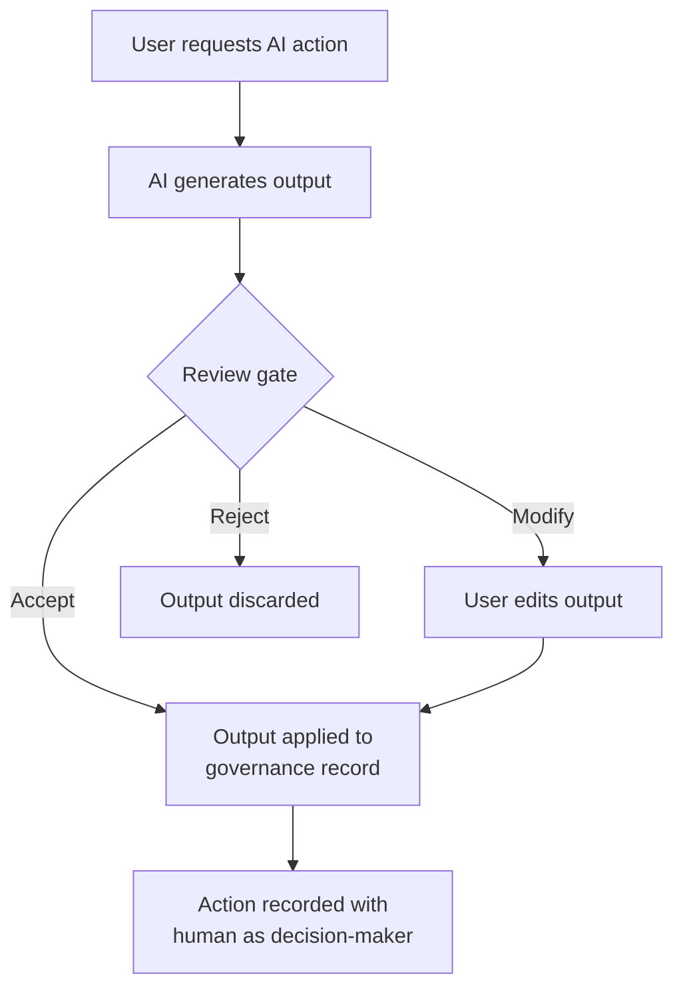

# Human-in-Control Model

Maysano is built on the principle that AI accelerates governance work, but humans remain in control of every decision that affects the governance record. This page describes how that principle is implemented across the platform.

---

## The Control Principle

Every AI feature in Maysano follows a consistent pattern:

1. **Human initiates** — AI does not act unless a user requests it.
2. **AI produces** — The AI generates a draft, recommendation, or analysis.
3. **Human reviews** — The output is presented for review. Nothing is committed.
4. **Human decides** — The user accepts, modifies, or rejects the output.
5. **Platform records** — Accepted outputs are recorded with the human as the author of the decision.

This pattern applies uniformly, whether the AI is drafting a specification, recommending quality checks, or generating an executive summary.

---

## Per-Role Control Model

Each role in Maysano has different interactions with AI, and each maintains clear control boundaries:

### Outcome Owner

- Uses AI to explore scenarios and test KPI measurability.
- AI never decides objectives — it only supports reasoning about them.
- The Outcome Owner approves all strategic decisions.

### Product Manager

- Uses AI to draft product specifications and identify gaps.
- AI supports decision-making around scope, priorities, and alignment.
- The Product Manager approves all product-level decisions.

### Product Owner

- Uses AI for metadata generation, DQ rule suggestions, and operational anomaly detection.
- AI accelerates operational tasks but does not replace validation.
- The Product Owner validates semantic correctness and operational relevance.

### System Steward

- Uses AI to encode governance intent into guidance rulesets.
- AI detects inconsistencies and drift across the portfolio.
- The System Steward reviews and approves all systemic changes.

---

## Approval Gates

AI outputs pass through explicit approval gates before affecting the governance record:

### Examples of Approval Gates

| AI Feature | What AI Produces | Approval Gate |
|---|---|---|
| Specification generation | Draft YAML specification | User reviews and edits before saving |
| Check recommendations | List of suggested checks | User selects which checks to create |
| Batch auto-setup | Per-table recommendations | User reviews all recommendations before creation |
| Executive summary | 3-4 sentence summary | User reads and decides whether to share |
| Remediation advice | Root cause hypotheses and fix steps | User evaluates and decides what to implement |

No approval gate can be bypassed. The platform does not provide a "trust AI and apply all" shortcut.

---

## Guidance Rulesets

Guidance rulesets are the mechanism through which the System Steward shapes AI behavior. They are sets of rules that constrain and direct what the AI produces.

### How Rulesets Work

1. The System Steward creates guidance rules organized by category.
2. Rules are published as immutable, versioned rulesets.
3. When the AI generates content, the active ruleset is included in its context.
4. The AI follows the rules when producing outputs.

### What Rulesets Control

- Vocabulary and terminology standards
- Required fields in generated specifications
- Preferred governance patterns
- Organizational conventions and naming rules

### What Rulesets Do Not Control

- Final content of specifications (humans edit after generation)
- Which governance components to attach (humans choose)
- Whether to accept AI recommendations (humans decide)

Rulesets shape AI outputs. They do not determine governance outcomes.

---

## Transparency

Maysano maintains transparency about AI involvement:

- AI-generated content is identifiable as such during the review phase.
- The AI assistant's conversational context is scoped to the current session and platform data — it does not have hidden knowledge or privileged access.
- Token usage, cost, and latency are tracked through observability metrics.
- Safety guardrails (input validation, timeout limits, cost budgets, failure handling) are applied to every AI interaction.

---

## What Human-in-Control Does Not Mean

- **Does not mean AI is always right.** AI outputs require critical evaluation.
- **Does not mean AI is always wrong.** Well-crafted AI outputs can significantly accelerate work.
- **Does not mean every click requires a confirmation dialog.** Control is exercised through the review-and-approve pattern, not through friction.
- **Does not mean AI is restricted to trivial tasks.** AI handles complex analyses (quality summaries, check recommendations, remediation planning) — but humans validate the results.
