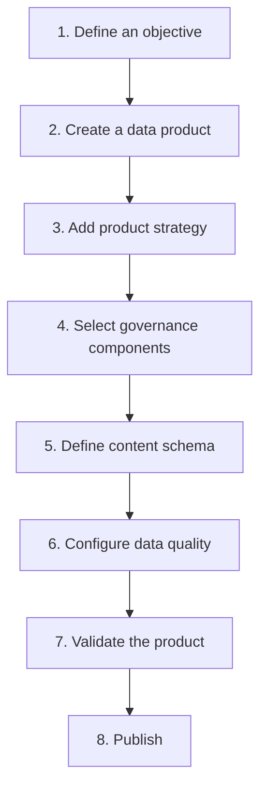

# First Product Walkthrough

This walkthrough guides you through creating your first data product in Maysano — from defining a business objective to publishing a governed, quality-assured product.

---

## Before You Start

You will need:

- A Maysano account with at least the Product Manager role
- A business objective or use case for the product
- (Optional) A source database connection for data quality checks

---

## The Eight Steps

---

## Step 1: Define an Objective

Start with why. Navigate to **Objectives** and create a new business objective.

- Give it a clear title (e.g. "Improve customer retention by 15%").
- Set the type (`growth`, `efficiency`, `compliance`, `risk`, or `innovation`).
- Set the priority and time horizon.
- Add an Outcome KPI that will measure success.

This step is typically done by the Outcome Owner. As a Product Manager, you may find that an objective already exists for you to align with.

---

## Step 2: Create a Data Product

Navigate to **Data Products** and create a new product.

- Choose a template if one fits your use case, or start from scratch.
- Enter a name, description, and product type (`dataset`, `api`, `stream`, `report`).
- Set visibility to `private` or `internal` for now.
- The product starts in `draft` status.

---

## Step 3: Add Product Strategy

In the product editor, open the **Strategy** section.

- Link the product to the objective you created (or an existing one).
- Define product-level KPIs that measure how well this product performs.
- Set target values and measurement frequency.

This creates the traceability chain: objective → outcome KPI → data product → product KPI.

---

## Step 4: Select Governance Components

Open the **Governance** section and attach components from the library:

- **DQ Profile** — Select a quality profile that matches your product's requirements. The profile declares target scores for each of the eight ODPS quality dimensions.
- **SLA Profile** — Select an SLA that matches your consumer commitments (uptime, latency, update frequency).
- **Access Profile** — Select an access profile that defines how consumers will authenticate and access data.

If no suitable components exist, ask your System Steward to create them.

---

## Step 5: Define Content Schema

Open the **Content Schema** section.

- Add the fields (columns) that make up your product's data structure.
- For each field, specify the data type, description, and whether it is required.
- Flag any fields that contain PII or sensitive data.
- Assign a data steward for important fields.

The content schema provides governance-aware documentation of your data structure.

---

## Step 6: Configure Data Quality

If you have a source database, set up quality monitoring:

1. **Connect** — Create or select a database connection.
2. **Own tables** — Bind the source tables that this product is responsible for.
3. **Recommend checks** — Use the AI to recommend quality checks based on your table schemas and DQ Profile targets.
4. **Review** — Review each recommendation. Accept, modify, or reject.
5. **Run** — Execute the checks and view your dimension scorecard.

This step is often done collaboratively between the Product Manager and Product Owner.

---

## Step 7: Validate the Product

Before publishing, review the product:

- Are all governance components attached?
- Does the content schema accurately describe the data?
- Are quality scores meeting the DQ Profile targets?
- Is the product strategy complete with KPI targets?

Use the AI assistant to review your specification and highlight any gaps.

---

## Step 8: Publish

When the product is ready:

1. Advance the lifecycle to `production`.
2. Publish a version with a change description.
3. The platform creates an immutable version snapshot.

The published version captures the full product state — metadata, governance components, content schema, and strategy — as a permanent record.

---

## What Happens Next

After publishing your first product:

- **Monitor quality** — Check the dimension scorecard regularly. Use AI remediation advice when scores drop.
- **Track KPIs** — Update current values for your Internal and Outcome KPIs.
- **Iterate** — Create new versions as the product evolves. Each version is independently traceable.
- **Scale** — Create additional products, reusing the same governance components.

---

## Summary

| Step | Action | Who |
|---|---|---|
| 1 | Define objective and outcome KPI | Outcome Owner |
| 2 | Create data product | Product Manager |
| 3 | Add product strategy and KPIs | Product Manager |
| 4 | Attach governance components | Product Manager / Product Owner |
| 5 | Define content schema | Product Owner |
| 6 | Configure DQ checks | Product Owner |
| 7 | Validate completeness | Product Manager |
| 8 | Publish version | Product Manager |
