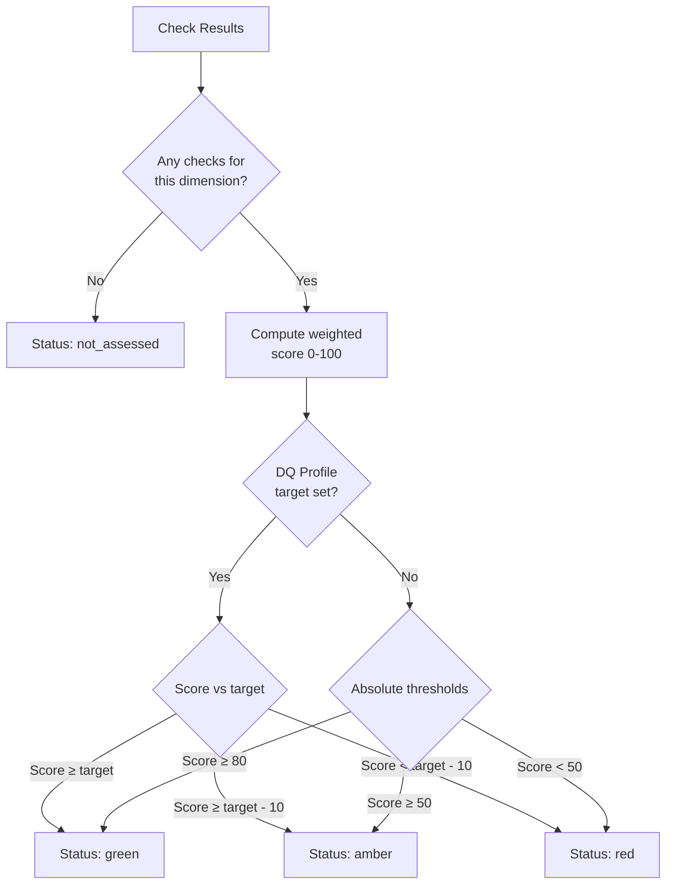
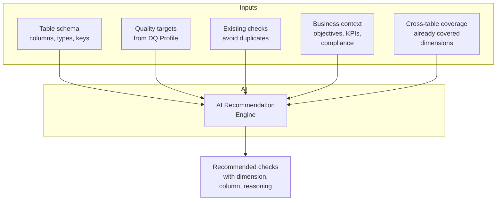
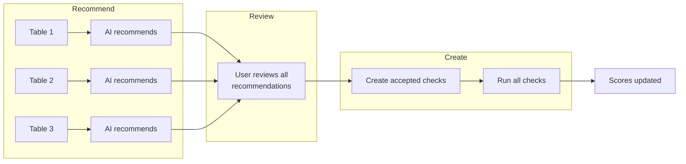
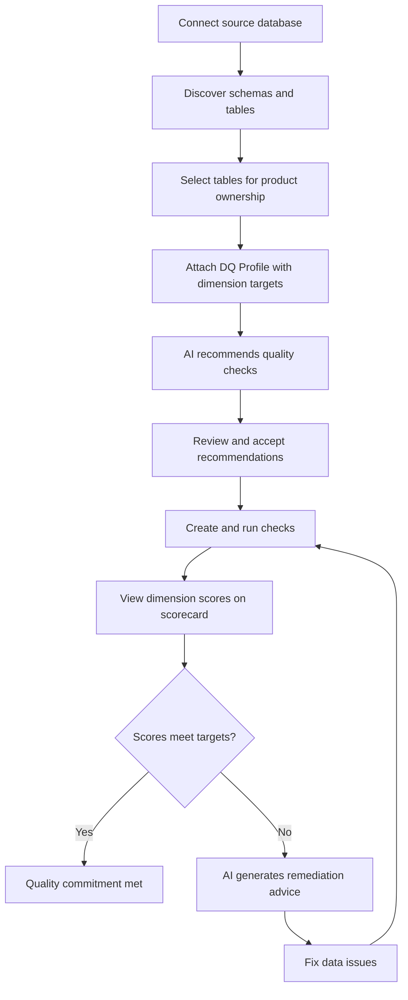

# Data Quality (DQ)

Data quality in Maysano is a first-class governance concern. It is not a reporting exercise or a dashboard add-on. It is embedded in the product model as a structured, measurable, and enforceable commitment.

Every data product can declare quality targets, bind source tables, run automated checks, and track dimension scores — all within a single governance workflow.

---

## What Data Quality Means in Maysano

Maysano separates **policy** from **evidence**.

- A **DQ Profile** is a policy artifact. It declares what quality dimensions matter and what target scores are acceptable.
- **DQ Checks** are evidence artifacts. They run against live data and produce measurable results.
- **Dimension Scores** synthesize check results into a per-dimension score (0–100) that is compared against the profile target.

This separation ensures that governance decisions (what matters) remain independent from operational execution (what was measured). A product can have a DQ Profile attached before any checks are configured — the profile represents intent, and the checks represent implementation.

Maysano aligns its quality model with the **Open Data Product Specification (ODPS) 4.1**, which defines eight standardized quality dimensions.

---

## The Eight Quality Dimensions

Maysano uses eight quality dimensions defined by ODPS 4.1. Every DQ Profile, check, and score maps to one of these dimensions.

| Dimension | Definition |
|---|---|
| **Accuracy** | The measurement of the veracity of data to its authoritative source. |
| **Completeness** | Data is required to be populated with a value. Checks whether all necessary data attributes are present in the dataset. |
| **Conformity** | Data content must align with required standards, syntax (format, type, range), or permissible domain values. |
| **Consistency** | Data should retain consistent content across data stores. Values, formats, and definitions in one group match those in another. |
| **Coverage** | All records are contained in a data store or data source. Relates to the extent and availability of data present but absent from a dataset. |
| **Timeliness** | The data must represent current conditions. The data is available and can be used when needed. |
| **Validity** | Data accurately and appropriately represents the real-world object or concept it is supposed to describe. |
| **Uniqueness** | Each record and attribute should be one-of-a-kind, aiming for a single, unique data entry. |

These eight dimensions provide a common vocabulary across teams, products, and governance profiles. When a stakeholder says "completeness is at 87%," every role in the organization interprets that against the same definition.

---

## DQ Profiles

A DQ Profile is a reusable governance component that declares quality targets for a data product.

### Profile Structure

| Field | Description |
|---|---|
| `name` | Human-readable profile name |
| `description` | Purpose and scope of the profile |
| `accuracy` | Target percentage (0–100) for the accuracy dimension |
| `completeness` | Target percentage for completeness |
| `conformity` | Target percentage for conformity |
| `consistency` | Target percentage for consistency |
| `coverage` | Target percentage for coverage |
| `timeliness` | Target percentage for timeliness |
| `validity` | Target percentage for validity |
| `uniqueness` | Target percentage for uniqueness |
| `version` | Semantic version (e.g. `1.0.0`) |
| `lifecycle` | Current lifecycle state |
| `isDefault` | Whether this is the default profile for new products |

### Lifecycle

DQ Profiles follow the standard governance component lifecycle:

**draft** → **development** → **testing** → **acceptance** → **production** → **sunset** → **retired**

A profile in `production` is considered active and enforceable. Profiles in `draft` or `development` can be edited freely. Once a profile is attached to a versioned product release, its targets become part of the immutable version record.

### Versioning

When a DQ Profile is updated, the version is incremented. Products that reference a specific profile version retain that reference. This prevents a profile change from silently altering the quality contract of an already-published product.

### What a Profile Does Not Do

A DQ Profile does not run checks, store results, or interact with source databases. It is a pure policy artifact — a declaration of "what good looks like."

---

## DQ Check Types

Maysano supports over 30 check types, organized by the ODPS dimension they assess. Each check type can operate at either the **table level** or the **column level**.

### Completeness Checks

| Check Type | Level | Description |
|---|---|---|
| `not_null` | Column | Verifies that a column contains no null values |
| `not_nulls_percent` | Column | Measures the percentage of non-null values in a column |
| `nulls_percent` | Column | Measures the percentage of null values in a column |
| `null_count` | Column | Counts the number of null values in a column |

### Coverage Checks

| Check Type | Level | Description |
|---|---|---|
| `row_count` | Table | Verifies the table contains a minimum number of rows |
| `row_count_in_range` | Table | Verifies the row count falls within an expected range |
| `row_count_change` | Table | Detects unexpected changes in row count between runs |

### Uniqueness Checks

| Check Type | Level | Description |
|---|---|---|
| `uniqueness` | Column | Verifies all values in a column are unique |
| `uniqueness_percent` | Column | Measures the percentage of unique values |
| `duplicate_percent` | Column | Measures the percentage of duplicate values |
| `distinct_count` | Column | Counts the number of distinct values in a column |

### Accuracy Checks

| Check Type | Level | Description |
|---|---|---|
| `numeric_in_range` | Column | Verifies numeric values fall within a specified range |
| `numeric_range` | Column | Validates the range (min/max) of numeric values |
| `min_value` | Column | Verifies the minimum value meets a threshold |
| `max_value` | Column | Verifies the maximum value does not exceed a threshold |
| `mean_in_range` | Column | Verifies the column mean falls within expected bounds |
| `median_in_range` | Column | Verifies the column median falls within expected bounds |

### Conformity Checks

| Check Type | Level | Description |
|---|---|---|
| `text_length` | Column | Verifies text values have the expected length |
| `text_match_regex` | Column | Verifies text values match a regular expression pattern |
| `text_not_match_regex` | Column | Verifies text values do not match an excluded pattern |
| `text_max_length` | Column | Verifies text values do not exceed a maximum length |
| `text_min_length` | Column | Verifies text values meet a minimum length requirement |

### Timeliness Checks

| Check Type | Level | Description |
|---|---|---|
| `data_freshness` | Table | Measures how recently the data was updated |
| `data_staleness` | Table | Detects data that has not been updated within an expected window |
| `date_in_range` | Column | Verifies date values fall within an expected range |
| `date_in_range_percent` | Column | Measures the percentage of date values within range |
| `datetime_in_range` | Column | Verifies datetime values fall within an expected range |
| `freshness` | Table | Alias for data freshness measurement |
| `staleness` | Table | Alias for data staleness detection |

### Validity Checks

| Check Type | Level | Description |
|---|---|---|
| `boolean` | Column | Verifies values conform to boolean format |
| `datetime` | Column | Verifies values conform to datetime format |
| `geographic` | Column | Verifies values conform to geographic coordinate format |
| `datatype` | Column | Verifies values match the expected data type |
| `custom_sql` | Table | Executes a custom SQL query and validates the result |
| `sql_expression` | Column | Evaluates a SQL expression against column values |

### Consistency Checks

| Check Type | Level | Description |
|---|---|---|
| `foreign_key_match` | Column | Verifies foreign key references resolve to valid records |
| `referential_integrity` | Column | Validates referential integrity between tables |
| `comparison` | Column | Compares values between two columns or tables |
| `column_count` | Table | Verifies the table has the expected number of columns |
| `column_type` | Column | Verifies a column has the expected data type |
| `column_exists` | Table | Verifies that a named column exists in the table |

---

## Check Structure

Every DQ check in Maysano follows a consistent structure.

| Field | Description |
|---|---|
| `name` | Human-readable name for the check |
| `check_type` | One of the 30+ supported check types (see above) |
| `check_mode` | Execution mode (e.g. `profiling`, `monitoring`, `partitioned`) |
| `time_scale` | Time granularity (`daily`, `monthly`, or custom) |
| `target_schema` | Database schema containing the target table |
| `target_table` | Table to check |
| `target_column` | Column to check (null for table-level checks) |
| `partition_by_column` | Optional column for partitioned checks |
| `parameters` | Check-specific parameters (thresholds, patterns, ranges) |
| `rule_parameters` | Severity thresholds (see below) |
| `is_active` | Whether the check is currently enabled |

### Severity Thresholds

Each check defines up to three severity levels in its `rule_parameters`:

| Severity | Weight | Meaning |
|---|---|---|
| **Warning** | 1.0 | Minor deviation. Data is usable but merits attention. |
| **Error** | 2.5 | Significant deviation. Data may be unreliable for some use cases. |
| **Fatal** | 5.0 | Critical failure. Data should not be used until resolved. |

The severity weights are used in score computation. A fatal failure has five times the impact of a warning on the dimension score.

---

## Scoring and Status

Maysano computes a quality score for each of the eight ODPS dimensions and an overall product score.

### Dimension Score Computation

Each dimension score is computed from the check results mapped to that dimension:

1. Collect all check results for the dimension.
2. Weight each failure by its severity (warning = 1, error = 2.5, fatal = 5).
3. Compute a weighted pass rate on a 0–100 scale.

A dimension with no checks configured is reported as **not_assessed** rather than scored. This distinction is important — it represents a governance gap, not a passing score.

### Target Comparison

When a DQ Profile is attached, each dimension score is compared against its target:

| Status | Condition |
|---|---|
| **Green** | Score meets or exceeds the target |
| **Amber** | Score is within 10 percentage points below the target |
| **Red** | Score is more than 10 percentage points below the target |
| **Not assessed** | No checks configured for this dimension |

When no DQ Profile target is set, absolute thresholds apply as a fallback:

| Status | Condition |
|---|---|
| **Green** | Score ≥ 80 |
| **Amber** | Score ≥ 50 |
| **Red** | Score < 50 |

---

## Dimension Scorecard

The dimension scorecard provides a consolidated view of all eight ODPS dimensions for a data product.

### What the Scorecard Shows

- A **radar chart** visualizing scores across all eight dimensions
- Per-dimension **score** (0–100), **status** (green/amber/red/not_assessed), and **check counts**
- An **overall score** computed from all assessed dimensions
- The **assessed count** — how many of the eight dimensions have active checks

### Drilling Into a Dimension

Selecting a dimension reveals:

- All checks mapped to that dimension
- Each check's latest result (passed/failed, actual value, expected value)
- Severity breakdown (warnings, errors, fatals)
- Execution history and timestamps

### Not Assessed vs Zero

A dimension showing **not_assessed** means no checks are configured. This is a governance gap that the scorecard makes visible. A dimension showing a score of 0 means checks exist and all failed — a quality crisis, not a coverage gap.

---

## Connection Management

Maysano connects to source databases through a connection management layer that supports multiple database engines.

### Supported Databases

| Database | Connection Type |
|---|---|
| PostgreSQL | `postgresql` |
| MySQL | `mysql` |
| SQL Server | `sqlserver` |
| BigQuery | `bigquery` |
| Snowflake | `snowflake` |

### Connection Lifecycle

Each connection follows a managed lifecycle:

1. **Create** — A connection is created with host, port, database, credentials, and connection type. Connections follow the naming convention `mlg-{productId}` for product-bound connections.
2. **Test** — The platform tests connectivity by listing schemas from the target database.
3. **Health Check** — Ongoing health checks verify that the connection is still reachable and functional.
4. **Recovery** — If a connection becomes unhealthy (database unreachable, connection not found), the platform attempts automatic recovery: re-discover by name, or re-create with default configuration.

### Connection Configuration

All connection parameters are configurable through environment variables. The platform uses environment-based configuration exclusively — no credentials are hard-coded or stored in application code.

### What Connection Management Does Not Do

Connection management does not execute queries against your data. It only validates connectivity and discovers table metadata (schemas, tables, columns). All data access is performed through DQ checks executed by the quality platform.

---

## Table Ownership

A data product in Maysano can own specific source tables. Table ownership determines which checks, results, and scores are associated with the product.

### Binding Tables to Products

Each product can declare a list of source tables:

| Field | Description |
|---|---|
| `connectionId` | The DQ connection used to access this table |
| `schema` | The database schema (e.g. `public`, `sales`) |
| `table` | The table name, or `*` for wildcard matching |

### Wildcard Support

Setting the table name to `*` matches all tables in the specified schema. This is useful when a product owns an entire schema and new tables should be automatically included.

### Scoping

When a product has source tables defined, all DQ views (scorecard, check list, results) are scoped to only those tables. Checks on tables not owned by the product are excluded from the product's quality scores.

When no source tables are defined, the product shows all checks from its connection — providing a broad view until ownership is refined.

---

## Quality Intelligence (AI)

Maysano includes AI-powered quality intelligence that transforms raw check results into actionable insights.

### Executive Summaries

The AI generates concise 3–4 sentence summaries for business stakeholders. Summaries highlight:

- Overall quality posture
- Strongest and weakest dimensions
- Governance gaps (not_assessed dimensions)
- Risk areas based on score trends

Summaries are written in non-technical language suitable for Outcome Owners and Product Managers.

### Remediation Advice

When checks fail, the AI provides:

- **Root cause hypotheses** — what might be causing the failure
- **Specific remediation steps** — actionable fixes with SQL examples where relevant
- **Priority ranking** — fatal and error severity issues first

Remediation can be requested for a single dimension or for all failing checks across the product.

### Check Recommendations

The AI recommends new checks based on:

- **Table schema** — column names, data types, nullability, and primary keys
- **Quality targets** — dimensions with explicit targets get priority coverage
- **Existing checks** — the AI avoids recommending checks that already exist
- **Business context** — linked objectives, KPIs, and compliance requirements influence recommendations
- **Cross-table coverage** — dimensions already covered by other tables in the product are deprioritized

Each recommendation includes the check type, target dimension, target column, and a one-sentence reasoning.

### Batch Auto-Setup

For products with multiple source tables, Maysano provides a batch auto-setup workflow:

1. **Recommend phase** — The AI analyzes all owned tables in parallel (concurrency of 3) and generates recommendations for each table.
2. **Review phase** — The user reviews, accepts, modifies, or rejects each recommendation.
3. **Create and run phase** — Accepted checks are created and executed in batch (concurrency of 5).

Progress is streamed via Server-Sent Events (SSE), providing real-time feedback as each table is processed.

---

## End-to-End Workflow

The complete DQ workflow in Maysano follows a structured sequence from connection to remediation.

### Step-by-Step

1. **Connect** — Create a connection to the source database. The platform validates connectivity.
2. **Discover** — Browse available schemas and tables through the connection.
3. **Own** — Bind specific tables (or wildcard schemas) to the data product.
4. **Profile** — Attach a DQ Profile declaring target scores for each dimension.
5. **Recommend** — Use AI to generate check recommendations based on schema, targets, and business context.
6. **Review** — Accept, modify, or reject each recommendation. Human review ensures governance intent is preserved.
7. **Run** — Execute checks against live data. Results are stored with full execution details.
8. **Score** — View the dimension scorecard. Compare scores against profile targets.
9. **Remediate** — For failing dimensions, use AI to generate remediation advice. Fix data issues and re-run.

---

## Incidents

When checks fail, Maysano tracks quality incidents to support investigation and resolution.

### Incident Structure

| Field | Description |
|---|---|
| `check_id` | The check that triggered the incident |
| `severity` | `warning`, `error`, or `fatal` |
| `status` | `open`, `acknowledged`, or `resolved` |
| `title` | Short description of the failure |
| `description` | Detailed failure information |
| `first_failure_at` | When the check first failed |
| `last_failure_at` | When the check most recently failed |
| `failure_count` | Number of consecutive failures |
| `acknowledged_at` | When someone acknowledged the incident |
| `acknowledged_by` | Who acknowledged it |
| `resolved_at` | When the incident was resolved |
| `resolved_by` | Who resolved it |
| `resolution_notes` | Explanation of how the issue was fixed |

### Incident Lifecycle

1. A check fails → an incident is created with status `open`.
2. A team member reviews and acknowledges the incident.
3. The issue is investigated and fixed.
4. The check passes again → the incident is marked `resolved` with resolution notes.

Incidents provide an audit trail of quality failures and their resolution. They separate "something broke" from "someone fixed it" — making accountability visible.

---

## Roles and DQ

Different roles interact with data quality at different levels:

### System Steward

- Creates and maintains DQ Profiles in the Governance Library
- Sets organizational quality standards and target ranges
- Defines which dimensions are mandatory for different product types
- Monitors governance gaps across the product portfolio

### Product Manager

- Selects the DQ Profile for their product
- Reviews AI-generated recommendations
- Approves check configurations
- Monitors dimension scores against business commitments

### Product Owner

- Implements DQ checks using the platform tooling
- Configures connections and table ownership
- Responds to quality incidents
- Uses remediation advice to fix data issues

### AI

- Recommends checks based on schema and business context
- Generates executive summaries for stakeholders
- Provides remediation advice for failing checks
- Supports batch auto-setup for multi-table products

AI does not create checks autonomously. Every recommendation requires human review and approval before it becomes an active check.

---

## What DQ Does Not Do

Data quality in Maysano has clear boundaries:

- **Does not replace your data pipeline.** DQ checks measure quality; they do not transform, clean, or repair data.
- **Does not access data directly.** All data access is performed through the connected quality platform, not by Maysano itself.
- **Does not enforce automatically.** A red score does not block a product release. Enforcement is a governance decision made by humans.
- **Does not guarantee correctness.** Check results reflect what was measured. If checks are misconfigured, scores may be misleading. Human review remains essential.
- **Does not store your data.** Maysano stores check results (scores, pass/fail, execution metadata). It does not copy or cache the underlying data being checked.
