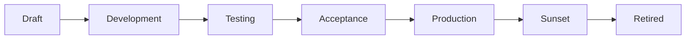

# Reusable Governance Components

Governance in Maysano is not written from scratch for each data product. It is assembled from a library of reusable, versioned components that encode organizational standards.

---

## What Reusable Components Are

A reusable governance component is a standalone, versioned artifact that captures a specific governance concern. Components are created once, maintained centrally, and attached to multiple data products.

This approach ensures consistency across the portfolio. When a Steward updates a quality standard, every product using that component benefits — without requiring product-by-product changes.

---

## Component Types

Maysano supports four types of governance components:

| Component | Purpose | Key Fields |
|---|---|---|
| **Data Quality (DQ) Profile** | Declares quality dimension targets (0–100 per dimension) | accuracy, completeness, conformity, consistency, coverage, timeliness, validity, uniqueness |
| **SLA Profile** | Declares service level commitments (latency, uptime, response time, etc.) | 11 standardized SLA dimensions |
| **Access Profile** | Declares authentication method, format, protocol, and rate limits | authMethod, format, protocol, rateLimit |
| **Pricing Plan** | Declares pricing model, currency, billing period, and included features | pricingModel, currency, price, billingPeriod, features |

Each component type is documented in detail in its own section of the Governance Library.

---

## Why Reuse Matters

Without reusable components, governance drifts. Teams invent their own quality thresholds, SLA definitions, and access rules. Over time, the portfolio becomes inconsistent — "99.9% uptime" means different things in different products.

Reusable components solve this by:

- **Standardizing definitions** — a "High Quality" DQ Profile means the same thing everywhere
- **Reducing duplication** — one profile serves many products
- **Enabling governance evolution** — update a component once, and all products using it benefit
- **Making drift visible** — products using outdated component versions can be identified and updated

---

## Lifecycle States

Every governance component follows a standardized lifecycle:

| State | Meaning |
|---|---|
| **Draft** | Initial creation. Can be freely edited. Not yet ready for use. |
| **Development** | Under active development. Structure is stabilizing. |
| **Testing** | Being validated against real scenarios or products. |
| **Acceptance** | Approved for use. Pending final promotion. |
| **Production** | Active and enforceable. Attached to live products. |
| **Sunset** | Deprecated. Existing products may still reference it, but new attachments are discouraged. |
| **Retired** | No longer available for use. Preserved for audit trail. |

### Lifecycle Rules

- Only components in `production` should be attached to live data products.
- A component in `sunset` remains valid for products already using it, but should not be newly attached.
- Retiring a component does not remove it from historical product versions — those versions are immutable.

---

## Versioning

Each component carries a semantic version (e.g. `1.0.0`).

- **Patch** (1.0.x) — Minor clarifications, no behavioral change.
- **Minor** (1.x.0) — New fields or relaxed constraints. Backward compatible.
- **Major** (x.0.0) — Breaking changes. May require products to re-evaluate their attachment.

When a product version is published, the governance component versions are captured in the immutable snapshot. This ensures that a published product always references the exact component version it was validated against.

---

## Creating vs Reusing

### Creating a New Component

Components are created by the **System Steward** role. The creation workflow:

1. Define the component with appropriate fields and values.
2. Set the lifecycle to `draft`.
3. Iterate through development and testing.
4. Promote to `production` when ready for use.

### Reusing an Existing Component

Products reuse components by **attaching** them:

1. The Product Manager or Product Owner selects a component from the Governance Library.
2. The platform records the component ID and version.
3. The product inherits the component's standards.

Attachment is non-destructive — the component remains independent. Multiple products can attach the same component without conflict.

---

## Governance Library as a Whole

The Governance Library is the collection of all reusable components across all types. It provides:

- A searchable catalog of available components
- Visibility into which products use which components
- Lifecycle tracking across the portfolio
- Version history and change audit

The library is not a static document. It is a living system that evolves as organizational standards mature.

---

## What Reusable Components Do Not Do

- **Do not enforce themselves.** A DQ Profile declares targets; it does not run checks. An SLA Profile declares commitments; it does not monitor uptime. Enforcement is a separate concern.
- **Do not replace product-specific configuration.** Components set the standard; products configure the implementation.
- **Do not prevent override.** A product can choose not to attach a component. Governance visibility (which products lack components) is the enforcement mechanism.
