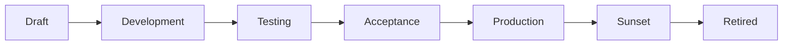

# Data Products

A data product in Maysano is the central unit of governance. It represents a governed, versioned, and measurable data asset that is linked to business objectives and controlled through reusable governance components.

---

## What a Data Product Is

A data product is not a table, a dashboard, or a pipeline. It is a structured declaration that a specific data asset:

- Has a defined purpose and owner
- Is linked to business objectives
- Has measurable quality, service, and access commitments
- Follows a lifecycle from draft to production to retirement
- Is versioned and immutable once published

Maysano data products are aligned with the **Open Data Product Specification (ODPS) 4.1**.

---

## Product Structure

| Field | Description |
|---|---|
| `name` | Human-readable product name |
| `description` | Purpose, scope, and context |
| `productId` | Unique business identifier |
| `status` | Current ODPS lifecycle state |
| `visibility` | `private`, `internal`, or `public` |
| `type` | Product type (e.g. `dataset`, `api`, `stream`, `report`) |
| `owner` | Accountable person or team |
| `version` | Current semantic version |
| `tags` | Categorization labels |
| `specification` | Full ODPS specification (JSON) |
| `yamlSpec` | ODPS specification in YAML format |

---

## Product Strategy

Each product can carry a strategy that captures:

### Business Objectives

Inline objectives with priority, status, and target dates. These can link to the enterprise objectives defined in the Objectives module.

### Strategy KPIs

Product-level KPIs with name, description, unit, target value, current value, and measurement frequency (`daily`, `weekly`, `monthly`, `quarterly`, `yearly`).

---

## Governance Attachments

A data product references governance components by ID:

| Attachment | Purpose |
|---|---|
| **SLA Profile** | Service level commitments |
| **DQ Profile** | Quality dimension targets |
| **Access Profile** | Authentication, format, protocol, and rate limits |
| **DQ Connection** | Source database connection for quality checks |
| **Source Tables** | Owned tables for DQ scoping |

These attachments create a complete governance contract for the product.

---

## ODPS Lifecycle

Data products follow the ODPS 4.1 lifecycle:

| State | Meaning |
|---|---|
| **Draft** | Initial creation. Product is being defined. |
| **Development** | Active development. Structure is stabilizing. |
| **Testing** | Being validated against real scenarios. |
| **Acceptance** | Approved. Pending final promotion. |
| **Production** | Live and available to consumers. |
| **Sunset** | Deprecated. Existing consumers may still use it. |
| **Retired** | No longer available. |

### Lifecycle Rules

- Products in `draft` can be freely edited.
- Advancing to `production` typically requires governance components to be attached and validated.
- Published versions are immutable — changes require a new version.

---

## Versioning

Products support semantic versioning. When a product is published:

1. A **version snapshot** is created capturing the full product state.
2. The snapshot includes all governance component references (SLA, DQ, Access Profile IDs and versions).
3. The snapshot is immutable — it cannot be modified after publication.
4. A `changeDescription` documents what changed in this version.

This ensures traceability. Given any version number, you can reconstruct the exact governance contract that was in effect.

---

## Content Schema

Products can define their data schema through content fields:

| Field | Description |
|---|---|
| `name` | Column or field name |
| `dataType` | Data type (string, integer, boolean, etc.) |
| `description` | What this field represents |
| `required` | Whether the field is mandatory |
| `sensitivity` | Data sensitivity level (`public`, `internal`, `confidential`, `restricted`) |
| `piiFlag` | Whether the field contains personally identifiable information |
| `steward` | Person responsible for this field |
| `sampleValues` | Example values for documentation |

The content schema provides a governance-aware view of the data structure — including sensitivity and PII flags that are not captured in technical schemas alone.

---

## Product Activities

Every significant action on a product is recorded as an activity:

| Field | Description |
|---|---|
| `activityType` | What happened (created, updated, published, etc.) |
| `description` | Human-readable description |
| `details` | Additional context |
| `performedBy` | Who performed the action |

Activities provide a chronological audit trail of product evolution.

---

## What Data Products Do Not Do

- **Do not contain data.** A data product is a governance artifact that describes and governs a data asset. The data itself lives in databases, warehouses, or lakes.
- **Do not replace pipelines.** Products describe what is delivered, not how it is built.
- **Do not enforce access.** Access Profiles declare access rules; infrastructure enforces them.
- **Do not auto-generate.** AI can assist in drafting specifications, but every product requires human ownership and approval.
