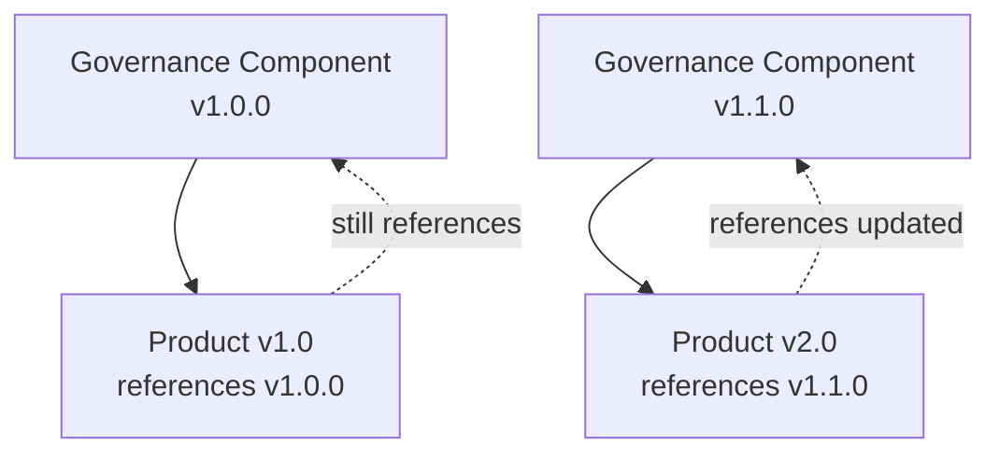

# Governance Components in Products

Data products in Maysano do not define governance rules from scratch. They select and attach reusable governance components from the Governance Library. This section explains how products consume governance components.

---

## How Products Use Components

Each data product can attach one component of each type:

| Component Type | Product Field | Purpose |
|---|---|---|
| SLA Profile | `slaId` | Service level commitments |
| DQ Profile | `dataQualityId` | Quality dimension targets |
| Access Profile | `accessProfileId` | Authentication, format, protocol, rate limits |

Attachment is done by referencing the component's ID. The product inherits the component's standards without duplicating the definition.

---

## Selection Process

Selecting governance components follows a collaborative workflow:

1. **System Steward** creates and maintains components in the Governance Library. Components are promoted through the lifecycle to `production`.
2. **Product Manager** selects which components apply to their product based on business requirements and consumer expectations.
3. **Product Owner** may also select components, particularly for DQ Profiles where operational expertise informs the choice.
4. **AI** can suggest appropriate components based on product type, description, and business context.

The selection is a governance decision. It represents a commitment: "This product will meet these standards."

---

## Version Pinning

When a product references a governance component, it references the component as it exists at that moment. When the product is published (versioned):

- The component ID and version are captured in the immutable version snapshot.
- Future changes to the component do not retroactively alter the published version.
- The product continues to reference the original component version until explicitly updated.

This ensures that published products have stable, auditable governance contracts.

---

## Multiple Products, Same Component

Multiple products can attach the same governance component. This is the primary benefit of the reusable model:

- A "Gold SLA" profile can serve all business-critical products.
- A "Standard DQ" profile can serve all internal operational products.
- Changes to the component benefit all products that adopt the new version.

---

## Products Without Components

A product can exist without governance components attached. This is valid during early stages (draft, development), but it represents a governance gap.

The platform makes these gaps visible:

- The product card shows which component slots are empty.
- The portfolio view can filter products by governance completeness.
- AI assistants may recommend components for products that lack them.

---

## Changing Components

A product can change its governance components at any time before publishing a new version:

- **Upgrade** — Attach a newer version of the same component.
- **Switch** — Attach a different component entirely.
- **Remove** — Detach a component (creating a governance gap).

All changes are tracked in the product activity log.

---

## What Governance Components in Products Do Not Do

- **Do not enforce themselves.** A DQ Profile declares targets; it does not run checks or block releases. Enforcement is operational.
- **Do not merge.** A product cannot partially adopt a component. It references the whole component or none of it.
- **Do not auto-update.** When a component is updated in the library, products must explicitly adopt the new version.
