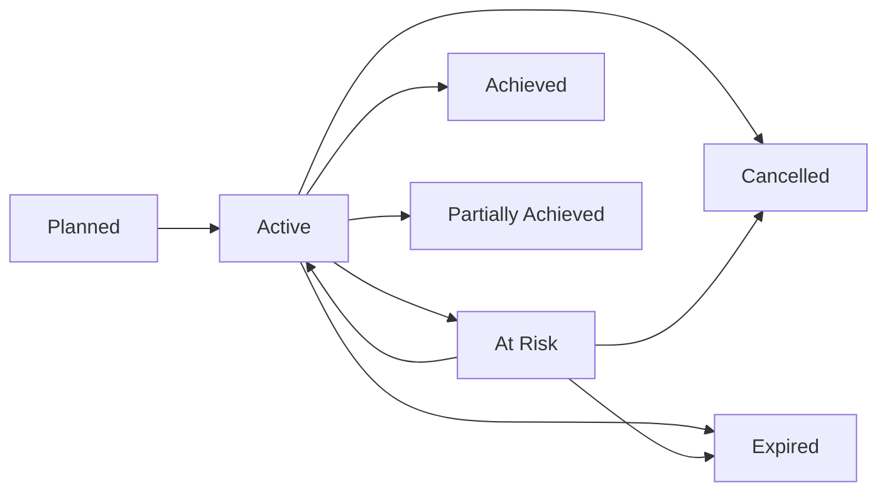

# Objectives

Objectives in Maysano represent the strategic business goals that data products exist to support. They are the top of the alignment chain: objectives define intent, KPIs measure progress, and data products deliver the capability.

---

## What Objectives Are

An objective is a structured declaration of business intent. It captures what the organization wants to achieve, why it matters, and when it should be realized.

Objectives are owned by the **Outcome Owner** role. They exist independently of any specific data product — a single objective may be supported by multiple products, and a product may contribute to multiple objectives.

---

## Objective Structure

| Field | Description |
|---|---|
| `title` | Concise statement of the objective |
| `description` | Detailed context and rationale |
| `strategicAlignment` | How this objective aligns with broader organizational strategy |
| `target` | Quantitative or qualitative target |
| `currentValue` | Current progress toward the target |
| `timeframe` | Expected completion period |
| `priority` | `high`, `medium`, or `low` |
| `status` | Current status (see lifecycle below) |
| `objectiveType` | Strategic category (see types below) |
| `outcomeHorizon` | Time horizon: `now`, `next`, or `later` |
| `businessOwner` | The person accountable for this objective |
| `startDate` | When work toward this objective begins |
| `endDate` | Target completion date |

---

## Objective Types

Each objective is categorized by its strategic purpose:

| Type | Description |
|---|---|
| **Growth** | Revenue expansion, market share, customer acquisition |
| **Efficiency** | Cost reduction, process optimization, resource utilization |
| **Compliance** | Regulatory adherence, audit readiness, legal requirements |
| **Risk** | Risk mitigation, resilience, business continuity |
| **Innovation** | New capabilities, experimentation, competitive differentiation |

Types help filter and prioritize objectives across the portfolio.

---

## Outcome Horizons

Objectives are tagged with a time horizon:

| Horizon | Meaning |
|---|---|
| **Now** | Immediate priority. Active investment and execution. |
| **Next** | Near-term. Planning and preparation underway. |
| **Later** | Long-term. Strategic intent captured but not yet active. |

---

## Status Lifecycle

Objectives follow a structured status progression:

| Status | Meaning |
|---|---|
| **Planned** | Defined but not yet active |
| **Active** | Currently being pursued |
| **At risk** | Progress is behind expectations |
| **Achieved** | Target met |
| **Partially achieved** | Some progress, but target not fully met |
| **Cancelled** | No longer pursued |
| **Expired** | Timeframe passed without completion |

---

## Linking Objectives

Objectives connect to three types of entities:

### Outcome KPIs

Each objective can be linked to one or more Outcome KPIs that measure whether the objective is being achieved. KPIs provide the evidence layer for strategic intent.

### Data Products

Objectives link to data products with an **impact level** (`high`, `medium`, `low`). This alignment makes it visible which products contribute to which strategic goals — and which products exist without clear business justification.

### Use Cases

Objectives can also link to business use cases — concrete scenarios that illustrate how the objective translates into operational reality.

---

## Objective History

Every change to an objective is recorded in an immutable history log:

| Field | Description |
|---|---|
| `action` | What happened (created, updated, status_changed, linked, unlinked) |
| `field` | Which field changed |
| `oldValue` | Previous value |
| `newValue` | New value |
| `summary` | Human-readable description of the change |
| `performedBy` | Who made the change |

This history provides a full audit trail of strategic decisions and their evolution over time.

---

## Who Manages Objectives

- **Outcome Owner** — Creates, updates, and owns objectives. Defines what success looks like.
- **Product Manager** — Consulted during objective creation. Links products to objectives.
- **System Steward** — Informed. Does not manage objectives directly.
- **Platform Admin** — Full access to all objective operations.

---

## What Objectives Do Not Do

- **Do not prescribe solutions.** Objectives define outcomes, not how to achieve them.
- **Do not replace product strategy.** Product vision and roadmap are owned by the Product Manager.
- **Do not auto-cascade.** Changing an objective does not automatically change linked KPIs or products. Alignment is maintained by humans.
