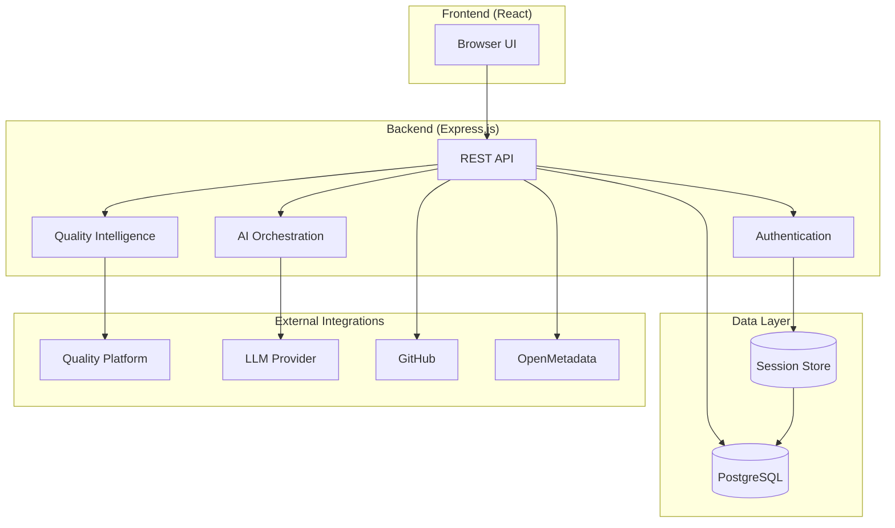

# Hosting Model

This page describes the architecture, deployment model, and integration boundaries of the Maysano platform.

---

## Architecture Overview

Maysano is a full-stack web application with a clear separation between frontend, backend, and external integrations.

### Frontend

- **Framework:** React 18 with TypeScript
- **Routing:** Wouter (lightweight client-side routing)
- **State:** TanStack React Query for server state
- **UI:** shadcn/ui components with Tailwind CSS
- **Build:** Vite (development HMR, production optimization)

### Backend

- **Framework:** Express.js with TypeScript
- **Runtime:** Node.js
- **API Pattern:** RESTful JSON API at `/api/*`
- **Authentication:** Session-based with PostgreSQL session store
- **Build:** esbuild for production bundling

### Data Layer

- **Database:** PostgreSQL
- **ORM:** Drizzle ORM with Zod validation
- **Sessions:** connect-pg-simple (PostgreSQL-backed sessions)

---

## Environment Configuration

All platform configuration is managed through environment variables:

| Variable | Purpose |
|---|---|
| `DATABASE_URL` | PostgreSQL connection string |
| `PORT` | Server port (defaults to 5000) |
| `NODE_ENV` | Environment (`development` or `production`) |
| `DQOPS_API_URL` | Quality platform API endpoint |
| `DQOPS_API_KEY` | Quality platform authentication key |
| `ANTHROPIC_API_KEY` | LLM provider API key |

Database connection credentials for quality checks are also configured through environment variables (see Data Handling).

No configuration is hard-coded. All secrets and connection details are externalized.

---

## External Integrations

### Quality Platform

Maysano connects to an external quality platform for DQ check execution:

- Connection is configured via `DQOPS_API_URL` and `DQOPS_API_KEY`.
- All DQ check creation, execution, and result retrieval flows through this integration.
- The quality platform connects to source databases — Maysano does not.

### LLM Provider

AI features connect to an external LLM provider:

- Configured via `ANTHROPIC_API_KEY`.
- Used for specification generation, quality summaries, remediation advice, and check recommendations.
- Requests include platform context (product metadata, quality scores) but not source data.

### GitHub

Optional integration for version control:

- OAuth-based authentication per user.
- Supports repository linking, specification syncing, and pull request creation.
- Tokens are scoped per user and stored in the database.

### OpenMetadata

Optional integration for metadata catalog:

- Connects to OpenMetadata instances for schema discovery and enrichment.
- Credentials stored encrypted in the database.
- Used for importing table schemas, column metadata, and quality indicators.

---

## Deployment Model

Maysano is designed as a single deployable unit:

- One Node.js process serves both the API and the static frontend assets.
- The production build bundles the server with esbuild and the client with Vite.
- The application can run on any platform that supports Node.js and PostgreSQL.

### Resource Requirements

- **Runtime:** Node.js 18+
- **Database:** PostgreSQL 14+
- **Memory:** Standard Node.js memory requirements
- **Network:** Outbound access to quality platform, LLM provider, and (optionally) GitHub and OpenMetadata

---

## What the Hosting Model Does Not Include

- **Multi-tenancy.** The current architecture serves a single organization per deployment. Multi-tenancy is achieved through separate deployments.
- **Built-in load balancing.** Load balancing, SSL termination, and reverse proxy configuration are handled by the hosting infrastructure.
- **Container orchestration.** Maysano does not prescribe a container strategy. It runs as a standard Node.js application.
- **Managed database.** PostgreSQL provisioning and management are infrastructure concerns.
